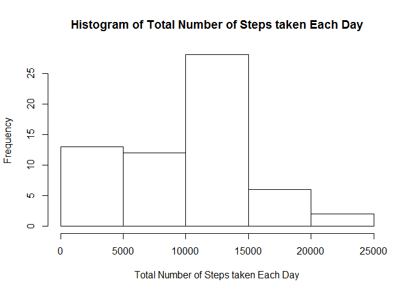
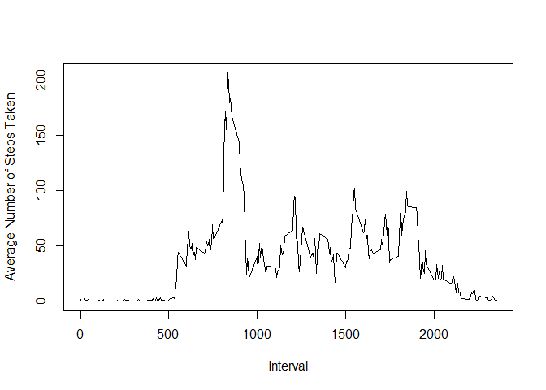
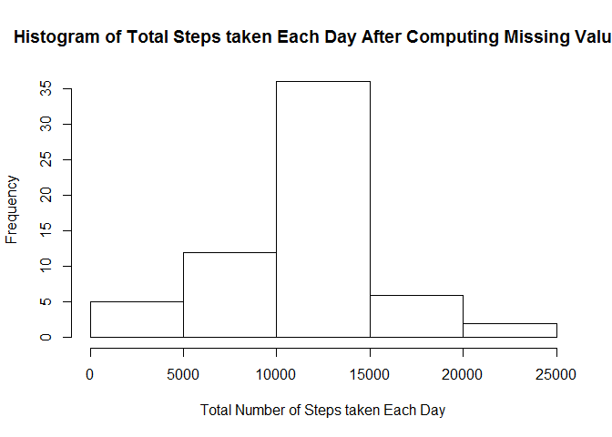
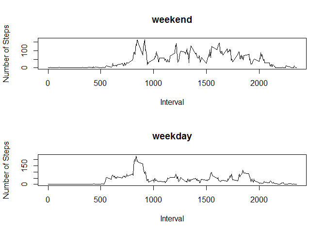

# Untitled

## Loading and preprocessing the data
1. Load the data

```r
act<-read.csv("activity.csv")
```

## What is mean total number of steps taken per day?
1. Calculate the total number of steps taken per day
2. Make a histogram of the total number of steps taken each day

```r
act$ndate<-as.Date(act$date)
actSum<-aggregate(act$steps,by=list(act$ndate),FUN=sum, na.rm=TRUE)
names(actSum)<-c("Date","SumSteps")
hist(actSum$SumSteps,main="Histogram of Total Number of Steps taken Each Day",xlab='Total Number of Steps taken Each Day')
```

<!-- -->

3. Calculate and report the mean and median of the total number of steps taken per day


```r
mean(actSum$SumSteps)
```

```
## [1] 9354.23
```

```r
median(actSum$SumSteps)
```

```
## [1] 10395
```

## What is the average daily activity pattern?
1. Make a time series plot (i.e. type = "l") of the 5-minute interval (x-axis) and the average number of steps taken, averaged across all days (y-axis)

```r
IntMean<-aggregate(act$steps,by=list(act$interval),FUN=mean, na.rm=TRUE)
names(IntMean)<-c("Interval","MeanSteps")
plot(IntMean$Interval, IntMean$MeanSteps, type="l", xlab="Interval",
     ylab="Average Number of Steps Taken" )
```

<!-- -->

2. Which 5-minute interval, on average across all the days in the dataset, contains the maximum number of steps?

```r
IntMean[which.max(IntMean$MeanSteps),]
```

```
##     Interval MeanSteps
## 104      835  206.1698
```


## Imputing missing values
1. Calculate and report the total number of missing values in the dataset (i.e. the total number of rows with NAs)

```r
sum(is.na(act$steps))
```

```
## [1] 2304
```

2. Devise a strategy for filling in all of the missing values in the dataset. Using the mean for that interval here
3. Create a new dataset that is equal to the original dataset but with the missing data filled in.

```r
library(plyr)
impute.mean <- function(x) replace(x, is.na(x), mean(x, na.rm = TRUE))
act2 <- ddply(act, ~ interval, transform, steps = impute.mean(steps))
```

4. Make a histogram of the total number of steps taken each day and Calculate and report the mean and median total number of steps taken per day. The values differ from the estimates from the first part of the assignment, and the histograms look more normal compared to the first. The impact of imputing missing data on the estimates of the total daily number of steps is, the mean and median are the same value, and less biased and more reflect the true values.

```r
act2Sum<-aggregate(act2$steps,by=list(act2$ndate),FUN=sum, na.rm=TRUE)
names(act2Sum)<-c("Date","SumSteps")
hist(act2Sum$SumSteps,main="Histogram of Total Steps taken Each Day After Computing Missing Values",xlab='Total Number of Steps taken Each Day')
```

<!-- -->

```r
mean(act2Sum$SumSteps)
```

```
## [1] 10766.19
```

```r
median(act2Sum$SumSteps)
```

```
## [1] 10766.19
```

## Are there differences in activity patterns between weekdays and weekends?
1. Create a new factor variable in the dataset with two levels - "weekday" and "weekend" indicating whether a given date is a weekday or weekend day.

```r
weekdays1 <- c('Monday', 'Tuesday', 'Wednesday', 'Thursday', 'Friday')
act2$wDay <- factor((weekdays(act2$ndate) %in% weekdays1), 
                   levels=c(FALSE, TRUE), labels=c('weekend', 'weekday'))
```

2. Make a panel plot containing a time series plot (i.e. type = "l") of the 5-minute interval (x-axis) and the average number of steps taken, averaged across all weekday days or weekend days (y-axis). 

```r
act2wday <- act2[act2$wDay=='weekday',]
act2wend <- act2[act2$wDay=='weekend',]

par(mfrow=c(2,1))
IntMeanWend<-aggregate(act2wend$steps,by=list(act2wend$interval),FUN=mean, na.rm=TRUE)
names(IntMeanWend)<-c("Interval","MeanSteps")
plot(IntMeanWend$Interval, IntMeanWend$MeanSteps, type="l", xlab="Interval",
     ylab="Number of Steps",main = 'weekend' )

IntMeanWday<-aggregate(act2wday$steps,by=list(act2wday$interval),FUN=mean, na.rm=TRUE)
names(IntMeanWday)<-c("Interval","MeanSteps")
plot(IntMeanWday$Interval, IntMeanWday$MeanSteps, type="l", xlab="Interval",
     ylab="Number of Steps",main = 'weekday' )
```

<!-- -->
